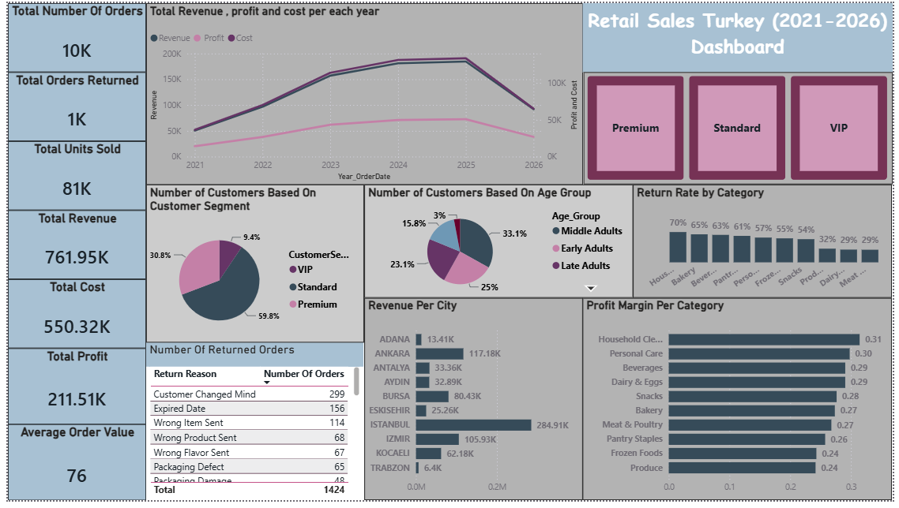

# Retail Sales Turkey Dashboard (2021–2026)

An end-to-end data analytics project covering data cleaning, relational data modeling, and interactive dashboard design using a multi-year retail sales dataset from Turkey.

## Overview

This project takes a raw, messy relational dataset (5 linked tables) through a full cleaning and analysis pipeline, ending in a Power BI dashboard that surfaces key business insights around sales performance, customer behavior, and product returns.

## Tools Used

- **Microsoft Excel** — data cleaning and standardization (Power Query, formulas)
- **Power BI** — data modeling, DAX measures, and dashboard visualization

## Dataset

The dataset consists of 5 related tables:

| Table | Description |
|---|---|
| `categories` | Product category reference data |
| `products` | Product catalog, linked to categories |
| `customers` | Customer demographic and segment data |
| `orders` | Order-level records, linked to customers |
| `order_details` | Line-item level detail per order (products, pricing, discounts, returns), linked to orders and products |

**Relationships:** `categories` → `products` → `order_details` ← `orders` ← `customers`

## Data Cleaning Process

The raw data contained a range of realistic data quality issues that were identified and resolved in Excel, including:

- Inconsistent ID casing (e.g. `prdct0001` vs `PRDCT0001`) — standardized to uppercase
- Inconsistent date formats across multiple columns (mixed `MM/DD/YYYY`, `DD-MM-YYYY`, `YYYY.MM.DD`, and written-month formats) — parsed and standardized to a single date format
- Inconsistent text casing in categorical fields (city, gender, region) — standardized
- Sentinel placeholder values (e.g. `9999-12-31`) used in place of true nulls for non-returned order lines — converted to proper blanks
- Stray whitespace in text fields — trimmed
- Verified referential integrity (no orphaned foreign keys) and checked for duplicate records across all tables

Derived/enrichment columns were added during cleaning to support analysis, including `Age_Group`, `Year`/`Month`/`MonthName` breakdowns for date fields, and calculated `TotalCost`, `Revenue`, and `Profit` per order line.

## Data Modeling

Table relationships were built directly in Power BI's Model view (star-schema shape, `order_details` as the central fact table), using single-direction, many-to-one relationships between each dimension table and the fact table.

## Key Metrics & DAX Measures

- Total Orders, Orders Returned, Return Rate
- Total Revenue, Total Cost, Total Profit, Profit Margin
- Average Order Value
- Revenue and Profit Margin by Category
- Revenue by City and by Customer Segment

## Dashboard Highlights

- **KPI summary row** — orders, returns, revenue, cost, profit, units sold, average order value
- **Revenue, cost, and profit trend by year** (2021–2026)
- **Customer segment and age group breakdown**
- **Return reasons and return rate by product category**
- **Revenue and customer distribution by city**
- **Profit margin by product category**
- Interactive filter buttons for customer segment (Premium / Standard / VIP)

## Key Insights

- Total revenue of ~761.95K with a profit margin of roughly 28% overall
- Istanbul leads in both customer count and total revenue, while cities like Ankara show strong revenue relative to a smaller customer base
- Standard-segment customers make up ~60% of the customer base, with Premium and VIP customers comprising the remainder
- Product returns are concentrated in a handful of return reasons ("Customer Changed Mind," "Expired Date," and "Wrong Item Sent" account for the largest share)
- Category-level profit margins range roughly 24%–31%, with Household Cleaning and Personal Care performing strongest

## Repository Contents

```
├── Clean_Data/               # Cleaned source CSVs (categories, products, customers, orders, order_details)
├── Raw_Data/               # Raw source CSVs (categories, products, customers, orders, order_details)
├── RetailSales.pbix       # Power BI dashboard file
├── Dashboard.png         # Dashboard preview images
└── README.md
```

## Known Limitations / Next Steps

- Return Rate by Category is under review for a calculation discrepancy and will be corrected in a future update
- 2021 and 2026 represent partial years of data, which affects the shape of the year-over-year trend line
- Potential future addition: connecting the model to a relational database (MySQL) instead of flat files, for enforced referential integrity

## Dashboard

